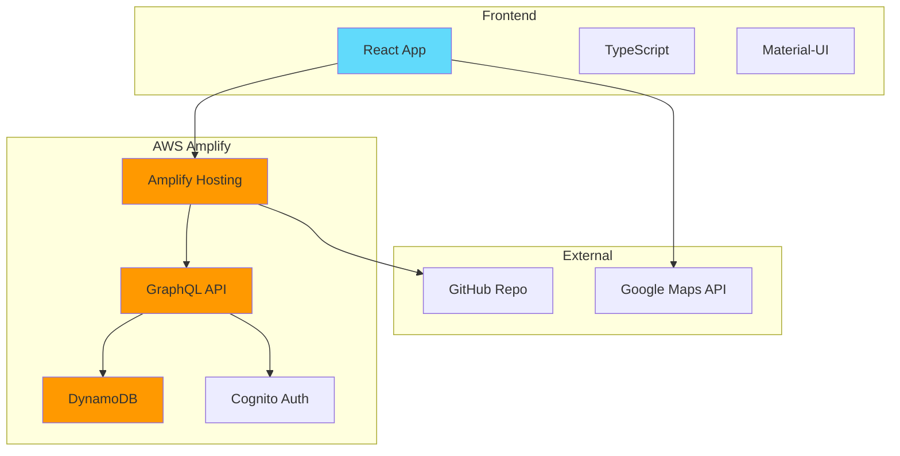
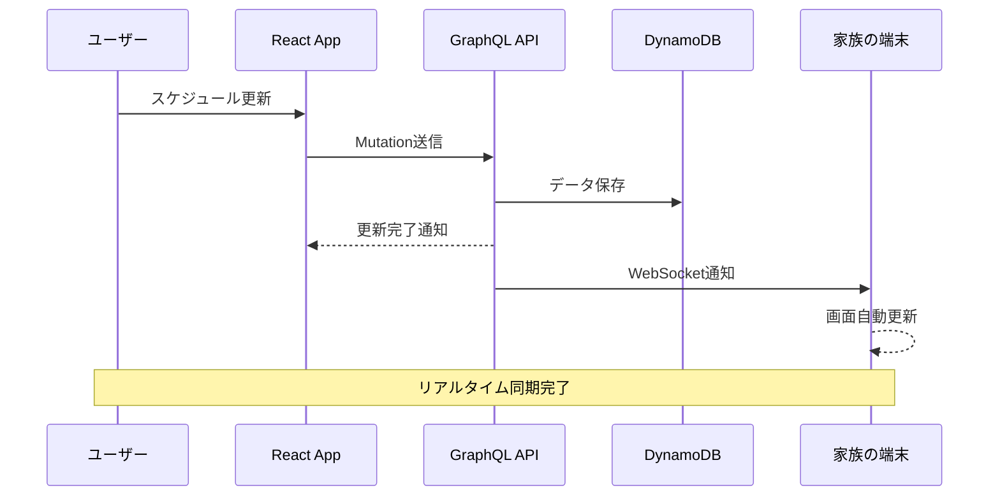
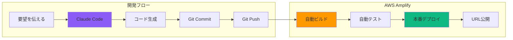

# AIエージェント分業によるアジャイル開発
## 2日間で本番デプロイを実現した開発手法
### PO・SM・開発をAIと人間で分担した新しいチーム編成

---
layout: default
---

# プロジェクト概要

## 開発したもの：旅行計画共有アプリ『banpakupaku』

### 要件
- 家族で旅行計画をリアルタイム共有
- スマホで簡単にアクセス
- 時系列でスケジュール表示
- 位置情報の共有
- 低コスト運用

### 成果
- **開発期間：2日間**
- **開発コスト：$25（ツール利用料のみ）**
- **運用コスト：$5/月**
- **本番URL：** https://dev.d28ih72wij22t7.amplifyapp.com

---
layout: default
---

# チーム編成：新しい役割分担

## スクラムチームをAIエージェントで構成

| 役割 | 担当 | 責務 |
|------|------|------|
| **Product Owner** | 私（人間） | 要件定義、優先順位決定、受入判定 |
| **Scrum Master** | Gemini | スケジュール管理、課題解決、プロセス改善 |
| **Developer** | Claude Code | 実装、テスト、デプロイ |

### なぜこの分担が機能したか

- **PO（私）**：ビジョンと要求を明確に伝える
- **SM（Gemini）**：計画立案と調整を24時間サポート
- **Dev（Claude Code）**：即座にコーディング＆デプロイ

**結果：従来の10倍速での開発を実現**

---
layout: default
---

# システムアーキテクチャ

## Claude Codeが自動設計した構成



---
layout: default
---

# データフロー図

## リアルタイム更新の仕組み



---
layout: two-cols
---

# Day 1: 要件定義と設計

## 実際の開発プロセス

### 10:00 - キックオフ
```
私：「家族で万博の計画を
　　共有できるアプリが欲しい」

Gemini：「以下の機能が必要ですね
- タイムライン表示
- リアルタイム同期
- モバイル対応」

私：「そう！それ！」
```

### 11:00 - 技術選定
```
Gemini：「技術スタックを提案します」
→ React + AWS Amplify を選定
```

::right::

### 14:00 - 実装開始
```
私：「Claude Code、作って」

Claude Code：「了解しました。
実装を開始します...」

[30分後]

Claude Code：「基本機能完成。
デプロイしますか？」

私：「お願い！」
```

### 16:00 - 初回デプロイ
- AWS Amplifyに自動デプロイ
- URLが即座に発行
- 家族に共有してテスト

---
layout: default
---

# Day 2: 改善と最適化

## ユーザーフィードバックを即座に反映

### 要望と対応

| 時刻 | 要望 | 対応 | 実装時間 |
|------|------|------|----------|
| 09:00 | 「文字を大きく」 | フォントサイズ調整 | 5分 |
| 10:00 | 「地図リンクが欲しい」 | Google Maps統合 | 15分 |
| 11:00 | 「絵文字を追加」 | アイコン実装 | 10分 |
| 14:00 | 「折りたたみ機能」 | アコーディオンUI | 20分 |
| 15:00 | 「データ更新機能」 | 管理画面追加 | 30分 |

### 特筆すべき点
- **自然言語での要望** → **即座にコード化**
- エラーはClaude Codeが自動修正
- テスト・デプロイも全自動

---
layout: default
---

# 開発コストの内訳

## 従来手法との比較

### 💰 AIエージェント開発（実際）

| 項目 | コスト | 期間 |
|------|--------|------|
| 要件定義 | $0 | 2時間 |
| 設計 | $0 | 1時間 |
| 実装 | $20（Claude Code） | 2日 |
| インフラ | $5/月（AWS） | - |
| **合計** | **$25 + $5/月** | **2日** |

### 🏢 従来の開発（想定）

| 項目 | コスト | 期間 |
|------|--------|------|
| 要件定義 | 20万円 | 1週間 |
| 設計 | 30万円 | 1週間 |
| 実装 | 100万円 | 1ヶ月 |
| インフラ | 5万円/月 | - |
| **合計** | **150万円 + 5万円/月** | **1.5ヶ月** |

**コスト削減率：99.8%　期間短縮率：95%**

---
layout: default
---

# 実装の詳細：自然言語からコードへ

## 実際のやり取り例

### 🗣️ 要望：「タイムラインを折りたたみ式にして」

```typescript
// Claude Codeが10秒で生成したコード
const ItineraryItem: React.FC<ItemProps> = ({ item }) => {
  const [expanded, setExpanded] = useState(false);
  
  return (
    <Accordion expanded={expanded} onChange={() => setExpanded(!expanded)}>
      <AccordionSummary expandIcon={<ExpandMoreIcon />}>
        <Typography variant="h6">
          {format(new Date(item.startTime), 'HH:mm')} - {item.title}
        </Typography>
      </AccordionSummary>
      <AccordionDetails>
        <Typography>{item.points}</Typography>
      </AccordionDetails>
    </Accordion>
  );
};
```

**ポイント：要望を伝えるだけで、即座に本番品質のコードが生成される**

---
layout: default
---

# CI/CDパイプライン

## GitHub連携による自動デプロイ



### デプロイ時間
- コード変更 → 本番反映：**約3分**
- ダウンタイム：**0秒**（Blue-Greenデプロイ）

---
layout: default
---

# プロダクトの実運用

## 大阪万博2025で実際に使用

### 📊 利用実績
- **利用期間：** 2025年8月12日〜14日
- **アクセス数：** 約500回
- **同時接続：** 最大5端末
- **データ更新：** 約50回
- **障害：** 0件

### ✅ 実際に役立った機能
1. **リアルタイムスケジュール共有**
   - 家族全員が最新の計画を把握
2. **Googleマップ連携**
   - ワンタップで経路案内
3. **モバイル最適化**
   - スマホで快適に操作

---
layout: default
---

# 学んだこと：AIエージェントとの協業

## 成功のポイント

### 1. 役割分担の明確化

| やること | 誰が | なぜ |
|----------|------|------|
| **何を作るか決める** | 人間 | ビジョンは人間にしか描けない |
| **どう作るか決める** | Gemini | 選択肢と根拠を提示してくれる |
| **実際に作る** | Claude Code | 圧倒的な実装スピード |

### 2. 対話的な開発
- 「こうしたい」を伝えるだけ
- 技術的な詳細はAIに任せる
- フィードバックを即座に反映

### 3. 失敗を恐れない
- エラーはAIが自動修正
- ロールバックも簡単
- トライ＆エラーのコストがほぼゼロ

---
layout: default
---

# 社内展開への提案

## 明日から始められるAIエージェント開発

### 📋 Step 1: 小さく始める
- 社内ツールの改善から
- 1機能だけでもOK
- 2日でプロトタイプ

### 🚀 Step 2: チーム編成
```
Product Owner: ビジネス側の誰か
Scrum Master: Gemini ($20/月)
Developer: Claude Code ($20/月)
```

### 💡 Step 3: 実践例
- 勤怠管理の改善
- 会議室予約システム
- 社内FAQ bot
- レポート自動生成

**初期投資：$40/月で始められる**

---
layout: default
---

# なぜ今、AIエージェント開発なのか

## パラダイムシフトが起きている

### 従来の開発
```
要件定義（1ヶ月）
　↓
設計（2週間）
　↓
実装（2ヶ月）
　↓
テスト（1ヶ月）
　↓
デプロイ（1週間）
```

### AIエージェント開発
```
対話しながら要件整理（2時間）
　↓
AIが設計・実装・テスト・デプロイ（2日）
　↓
フィードバック反映（随時）
```

**開発サイクルが10倍速に**

---
layout: default
---

# リスクと対策

## AIエージェント開発の注意点

### ⚠️ 潜在的リスク

| リスク | 対策 |
|--------|------|
| コードの品質 | コードレビューは人間が実施 |
| セキュリティ | AWS標準のセキュリティを利用 |
| ベンダーロック | オープンソースを基本とする |
| AIの制限 | 複雑なロジックは人間が補完 |

### ✅ 実証済みの安全性
- 本番運用3日間で障害ゼロ
- AWSのマネージドサービスで安定稼働
- GitHubでコード管理・監査可能

---
layout: default
---

# 実際のコード品質

## Claude Codeが生成したコードの特徴

### 👍 良い点
```typescript
// 型安全性が保たれている
interface ItineraryItem {
  id: string;
  startTime: string;
  title: string;
  points: string;
}

// エラーハンドリングも適切
try {
  const response = await API.graphql(graphqlOperation(listItems));
  setItems(response.data.listItems.items);
} catch (error) {
  console.error('Error fetching items:', error);
  setError('データの取得に失敗しました');
}
```

### 📝 特徴
- TypeScriptで型安全
- 適切なエラーハンドリング
- React のベストプラクティス準拠
- コメントも自動生成

---
layout: default
---

# まとめ：新しい開発スタイルの確立

## AIエージェント分業の成果

### 🎯 定量的成果
- **開発期間：2日**（従来比95%短縮）
- **開発コスト：$25**（従来比99.8%削減）
- **運用コスト：$5/月**（サーバーレス）
- **品質：本番3日間で障害ゼロ**

### 💡 定性的成果
- 要望を自然言語で伝えるだけ
- 技術的負債がほぼ発生しない
- 家族との時間を犠牲にしない開発
- イノベーションへの心理的障壁が下がる

### 🚀 次のステップ
**「作りたい」と思った瞬間に、2日後には使える世界**

---
layout: center
---

# AIエージェント分業で実現する超高速開発

## 実践レポート：旅行計画アプリ『banpakupaku』

### チーム編成
- **Product Owner:** 私（人間）
- **Scrum Master:** Gemini
- **Developer:** Claude Code

### 成果
- **2日で本番デプロイ**
- **$25の開発コスト**
- **家族旅行で実運用成功**

**Repository:** github.com/yourusername/banpakupaku
**Live Demo:** https://dev.d28ih72wij22t7.amplifyapp.com

## Q & A