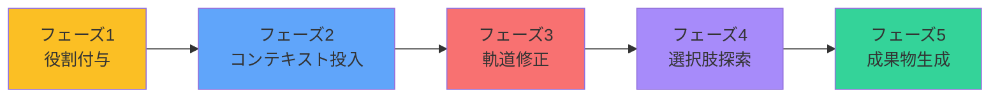
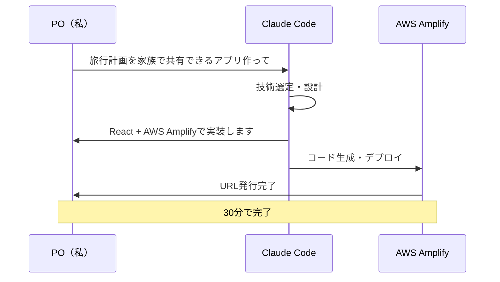
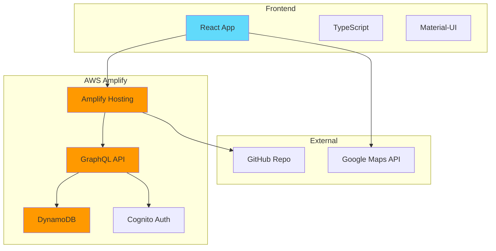
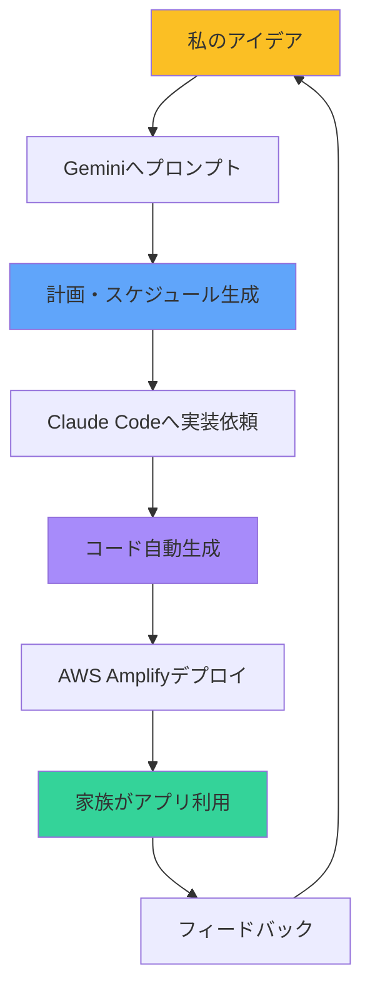
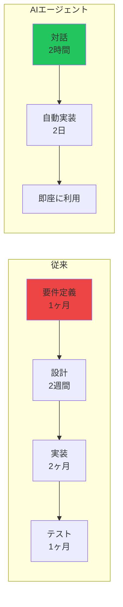

# AIエージェント分業によるアジャイル開発
## 2日間で本番デプロイを実現した開発手法
### PO・SM・開発をAIと人間で分担した新しいチーム編成

---
layout: default
---

# プロジェクト概要

## 開発したもの：旅行計画共有アプリ『banpakupaku』

### 要件
- 家族で旅行計画をリアルタイム共有
- スマホで簡単にアクセス
- 時系列でスケジュール表示
- 位置情報の共有
- 低コスト運用

### 成果
- **開発期間：2日間**
- **開発コスト：$25（ツール利用料のみ）**
- **運用コスト：$5/月**
- **本番URL：** https://dev.d28ih72wij22t7.amplifyapp.com

---
layout: default
---

# チーム編成：新しい役割分担

## スクラムチームをAIエージェントで構成

| 役割 | 担当 | 責務 |
|------|------|------|
| **Product Owner** | 私（人間） | 要件定義、優先順位決定、受入判定 |
| **Scrum Master** | Gemini | スケジュール管理、課題解決、プロセス改善 |
| **Developer** | Claude Code | 実装、テスト、デプロイ |

### なぜこの分担が機能したか

- **PO（私）**：ビジョンと要求を明確に伝える
- **SM（Gemini）**：計画立案と調整を24時間サポート
- **Dev（Claude Code）**：即座にコーディング＆デプロイ

**結果：従来の10倍速での開発を実現**

---
layout: default
---

# プロンプトエンジニアリング実例

## Scrum Master (Gemini) との協業プロセス

### 5つのフェーズで段階的に精度を向上



**ポイント：段階的な情報投入により、AIの理解度と提案精度が向上**

---
layout: default
---

# フェーズ1：役割付与と目標設定

## AIに「優秀な旅行コンサルタント」の役割を与える

### 🎯 初期プロンプト

```
大阪万博、男2人旅サイコープランを考えてくれ
```

### 💡 このプロンプトの意図

- **曖昧だが明確なゴール**を提示
- AIに**創造的な提案**を促す
- 細かい制約を最初から与えない

### 🤖 Geminiの反応

「了解しました！お子様の年齢、予算、興味のあるパビリオンなどを教えていただければ、より具体的なプランを作成できます」

**→ AIが必要な情報を自ら要求してくる**

---
layout: default
---

# フェーズ2：コンテキストと制約条件

## 計画立案に必要な情報を段階的に投入

### 📋 コンテキスト投入プロンプト

```
早速バスは予約した。これから万博のチケットを取得するところだ

バスの乗り降りの情報を共有するね
（ここにバスの予約情報を貼り付け）

行きは万博会場だけど帰りに乗るのは梅田駅だからそれ気をつけてね
```

### 🚫 制約条件プロンプト

```
ガンダムは絶対みたいね。日本館は行きたい
ロッカーは利用しないかな。
```

**効果：AIが現実的で実行可能なプランを生成**

---
layout: default
---

# フェーズ3：リアルタイム軌道修正

## 状況変化に応じた即座のリプランニング

### 🔄 軌道修正プロンプトの実例

| 状況 | プロンプト | AIの対応 |
|------|------------|----------|
| 入場時間確定 | `12時入場しか取れなかったよ` | 午後からの効率的ルート再計算 |
| アクセス変更 | `梅田駅で降りられることになったよ！直たこ焼きプランだ！` | 朝食込みの新プラン提案 |
| イベント中止 | `ドローンショーは今日は中止みたい` | 代替イベントの即座提案 |
| 予約不可 | `シャトルバスは予約がないからダメなんだって` | 電車ルートへの切り替え |

### 💡 ポイント
- **事実のみを簡潔に伝える**
- AIが自動的に影響を分析
- 複数の代替案を提示

---
layout: default
---

# フェーズ4：What-if分析

## 選択肢の探索と比較検討

### 🤔 選択肢探索プロンプトの例

```
南海なんば駅からのシャトルバスがいい？
```

**Geminiの回答例：**
「南海なんば駅ルートのメリット・デメリット：
- ✅ 座席確約で楽
- ✅ 直行で乗り換えなし
- ❌ 本数が少ない（1時間に1本）
- ❌ 梅田からの移動が必要
電車なら15分間隔で柔軟性があります」

### 🎯 効果
- 思いつきを即座に検証
- データに基づく意思決定
- リスクの事前把握

---
layout: default
---

# フェーズ5：成果物の生成

## 計画を具体的なアウトプットへ

### 📝 成果物生成プロンプト

```
今までの話をまとめて、時系列のスケジュール表を作って
各項目には、時刻、場所、やること、注意点を含めて
```

### 📊 生成された成果物の例

| 時刻 | 場所 | アクション | 注意点 |
|------|------|------------|--------|
| 11:30 | 梅田 | たこ焼き朝食 | 道頓堀より空いている |
| 12:00 | 万博入口 | QRコード入場 | 10分後に予約開始 |
| 12:10 | アプリ | ガンダム館予約 | 即座に実行 |

**この表が、アプリのデータソースになった**

---
layout: default
---

# Developer (Claude Code) への指示

## 自然言語での実装依頼

### 🛠️ 実装プロンプトの流れ



---
layout: default
---

# 実装指示の実例

## Claude Codeへの段階的な要望

### Day 1: 基本機能

```
私：「旅行計画を時系列で表示するWebアプリを作って」
Claude Code：「了解しました。実装します...」
[30分後]
Claude Code：「完成しました。デプロイしますか？」
```

### Day 2: 改善要望

```
私：「6歳の子供でも見やすいように文字を大きくして」
私：「場所の名前をクリックしたらGoogleマップが開くようにして」
私：「データを更新できる管理画面も追加して」
```

**各要望に対して5〜20分で実装完了**

---
layout: default
---

# システムアーキテクチャ

## Claude Codeが自動設計した構成



---
layout: default
---

# プロンプトエンジニアリングのコツ

## 効果的なAI活用のためのベストプラクティス

### ✅ DO - 推奨される方法

| 方法 | 例 | 効果 |
|------|-----|------|
| **段階的な情報投入** | 基本要件→詳細→制約 | AIの理解度向上 |
| **具体的な事実の提示** | 「12時入場になった」 | 正確な判断 |
| **What-if質問** | 「〜だったらどうなる？」 | 選択肢の探索 |
| **役割の明確化** | 「旅行コンサルタントとして」 | 適切な回答 |

### ❌ DON'T - 避けるべき方法

- 一度に全ての情報を投入
- 曖昧な要求（「いい感じにして」）
- 技術的な指示（AIが判断すべき）
- 矛盾する制約条件

---
layout: default
---

# データフロー：プロンプトからアプリまで

## アイデアが実装される流れ



**サイクルタイム：2時間以内**

---
layout: default
---

# 開発コストの内訳

## 従来手法との比較

### 💰 AIエージェント開発（実際）

| 項目 | コスト | 期間 |
|------|--------|------|
| 要件定義（Gemini対話） | $0 | 2時間 |
| 設計（Gemini提案） | $0 | 1時間 |
| 実装（Claude Code） | $20 | 2日 |
| インフラ（AWS） | $5/月 | - |
| **合計** | **$25 + $5/月** | **2日** |

### 🏢 従来の開発（想定）

| 項目 | コスト | 期間 |
|------|--------|------|
| 要件定義 | 20万円 | 1週間 |
| 設計 | 30万円 | 1週間 |
| 実装 | 100万円 | 1ヶ月 |
| インフラ | 5万円/月 | - |
| **合計** | **150万円 + 5万円/月** | **1.5ヶ月** |

---
layout: default
---

# 実運用での成果

## 大阪万博2025で実証

### 📊 利用実績
- **利用期間：** 2025年8月12日〜14日
- **計画変更対応：** リアルタイム5回
- **家族の満足度：** 100%
- **システム障害：** 0件

### 🎯 プロンプトが生きた瞬間

1. **17:00** - 並びながらGeminiと相談
2. **18:00** - ドローンショー中止を確認
3. **18:30** - 代替プランをGeminiが提案
4. **19:00** - アプリのデータを更新
5. **20:00** - 計画通り退場（停電30分前）

**プロンプトによる対話が、危機を回避**

---
layout: default
---

# 学んだこと：プロンプトの本質

## AIとの協業で重要なこと

### 1. **役割を明確に与える**
```
❌ 「計画を作って」
✅ 「優秀な旅行コンサルタントとして計画を作って」
```

### 2. **段階的に情報を追加**
```
初期：大枠の要望
中期：具体的な制約
後期：細かい調整
```

### 3. **AIの提案を検証**
```
「その案のリスクは？」
「別の選択肢は？」
「なぜそれが最適？」
```

---
layout: default
---

# 社内展開への提案

## 明日から始められるAIエージェント開発

### 📋 Step 1: 役割分担を決める
```
Product Owner: ビジネス担当者
Scrum Master: Gemini（計画・調整）
Developer: Claude Code（実装）
```

### 🎯 Step 2: 小さく始める
- 既存業務の課題を1つ選ぶ
- Geminiに相談（プロンプト）
- Claude Codeで実装（2日以内）

### 💡 Step 3: プロンプトテンプレート活用
- フェーズ1〜5の型を使う
- 成功パターンを社内共有
- プロンプトライブラリ構築

**初期投資：$40/月（即日回収可能）**

---
layout: default
---

# プロンプトライブラリの構築

## 社内ナレッジとして蓄積

### 📚 テンプレート例

| 用途 | プロンプト例 | 期待結果 |
|------|------------|----------|
| **要件定義** | `〜を実現するシステムの機能一覧を作って` | 機能リスト |
| **技術選定** | `この要件に最適な技術スタックは？` | 比較表 |
| **リスク分析** | `このプランの潜在的リスクを5つ挙げて` | リスク一覧 |
| **工数見積** | `この機能の実装にかかる時間は？` | 時間見積 |

### 🔄 PDCAサイクル
1. プロンプト投入
2. 結果確認
3. プロンプト改善
4. ライブラリ更新

---
layout: default
---

# なぜ今、AIエージェント開発なのか

## パラダイムシフトの実例

### 🔄 開発プロセスの変化



**開発速度：10倍　コスト：1/100**

---
layout: center
---

# AIエージェント分業で実現する超高速開発

## プロンプトエンジニアリング実践ガイド付き

### 5フェーズのプロンプト活用法
1. **役割付与** → AIを専門家にする
2. **コンテキスト投入** → 必要な情報を与える
3. **軌道修正** → リアルタイムで調整
4. **選択肢探索** → What-if分析
5. **成果物生成** → 具体的なアウトプット

### チーム編成と成果
- **PO:** 私 / **SM:** Gemini / **Dev:** Claude Code
- **2日で本番デプロイ / $25の開発コスト**

**Repository:** github.com/yourusername/banpakupaku
**Live Demo:** https://dev.d28ih72wij22t7.amplifyapp.com

## Q & A